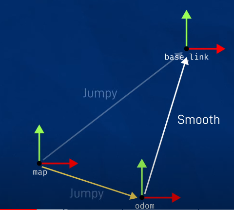

# README

All code base on:
- [Making a Mobile Robot #2 - Concept Design URDF](https://articulatedrobotics.xyz/mobile-robot-2-concept-urdf/)
- [Making a Mobile Robot #3 - Concept Design Gazebo](https://articulatedrobotics.xyz/mobile-robot-3-concept-gazebo/)
- [Making a Mobile Robot #8 - Adding a Lidar](https://articulatedrobotics.xyz/mobile-robot-8-lidar/)


## SLAM_Toolbox
- [Easy SLAM with ROS using slam_toolbox](https://youtu.be/ZaiA3hWaRzE)

Odom represent our world origin
- Odometry effectively measure robot velocity
- Velocity integrated to estimate position (**dead reckoning**), so velocity error will compound over time.




### base_footprint
base_footprint frame is a 2D shadow if base_link

```bash
<!-- BASE FOOTPRINT -->
<link name="base_footprint">
</link>

<joint name="base_footprint_joint" type="fixed">
    <parent link="base_link" />
    <child link="base_footprint" />
    <origin xyz="0 0 0" />
</joint>
```


### config

```
cp /opt/ros/humble/share/slam_toolbox/config/mapper_params_online_async.yaml src/bot_description/config/
```